# Images

There are a number of images that can be uploaded to the report. Images require a path to the image
and the key for the image. The image key is used to tell IPR how to place the image in the report.
The following are examples with their expected format and image key.

```json
{
    "images": [
        {
            "key": "string",
            "path": "/path/to/image/file",
            "title": "",
            "caption": ""
        }
    ]
}
```

## Mutation Signature Plots

key: `mutSignature.barplot.sbs`


key: `mutSignature.barplot.dbs`

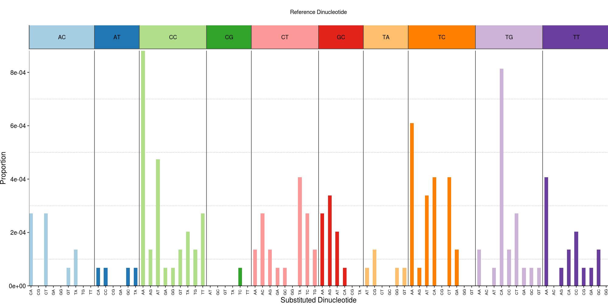

key: `mutSignature.barplot.indels`

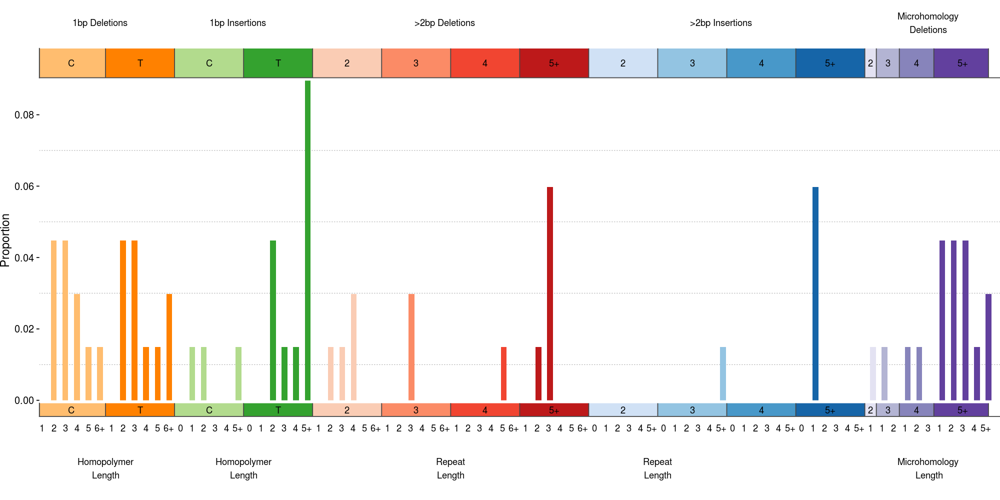


## Expression Correlation Subtyping Plots

key: `subtypePlot\.\S+`

## Copy Number Circos Plot

key: `cnvLoh.circos`

## Mutation Burden Plots

full pattern: `mutationBurden\.(barplot|density|legend)_(sv|snv|indel)\.(primary|secondary|tertiary|quaternary)`

### SNVs

key: `mutationBurden\.density_snv\.(primary|secondary|tertiary|quaternary)`

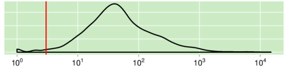

key: `mutationBurden\.barplot_snv\.(primary|secondary|tertiary|quaternary)`

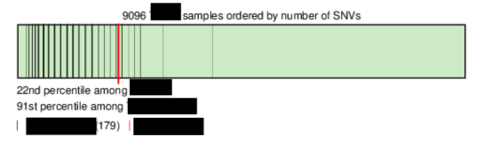

key: `mutationBurden\.density_indel\.(primary|secondary|tertiary|quaternary)`

### Indels

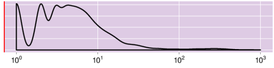

key: `mutationBurden\.barplot_indel\.(primary|secondary|tertiary|quaternary)`

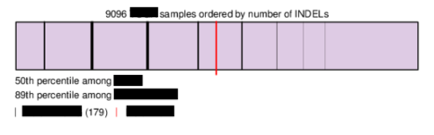

### Structural Variants

key: `mutationBurden\.density_sv\.(primary|secondary|tertiary|quaternary)`

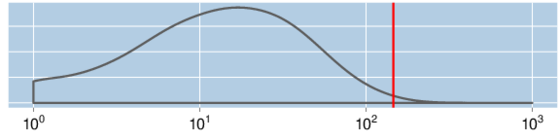

## Expression Density Plots

key: `expDensity\.(\S+)`

In the above the pattern is expected to be `expDensity.<gene name>` where the gene name
matches the gene name(s) used for the expression variant definitions

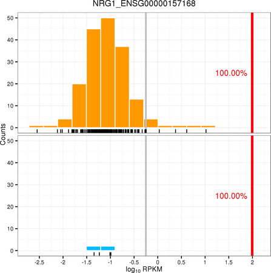

## Expression Correlation Plot

keys: `expression.chart`, `expression.legend`

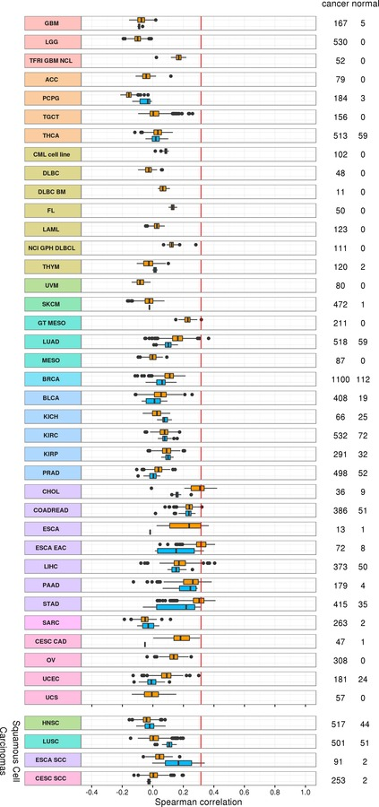

## Structural Variant Circos Plots

keys: `circosSv.genome`, `circosSv.transcriptome`

## Microbial Integration Circos Plots

keys: `microbial.circos.genome`, `microbial.circos.transcriptome`

## Immune Related Plots

### Cibersort

[Cibersort Publication](https://www.nature.com/articles/nmeth.3337)

key: `cibersort.cd8_positive_t-cell_scatter`

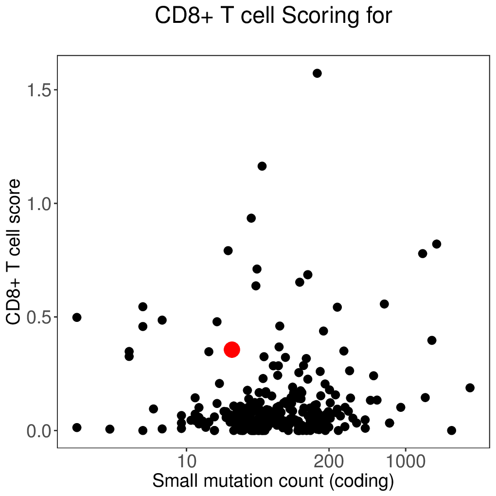

key: `cibersort.combined_t-cell_scatter`

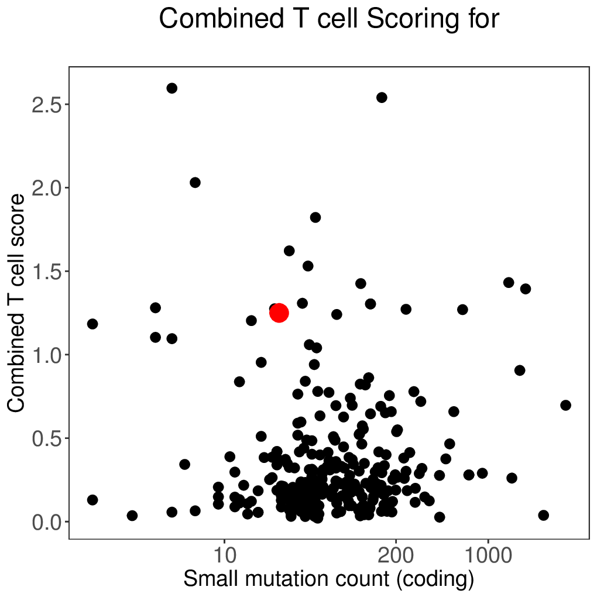

### MiXCR

[MiXCR Publication](https://pubmed.ncbi.nlm.nih.gov/25924071/)

key: `mixcr.circos_trb_vj_gene_usage`

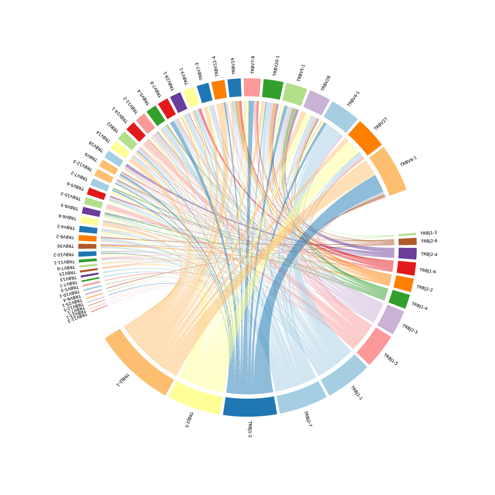

key: `mixcr.dominance_vs_alpha_beta_t-cells_scatter`

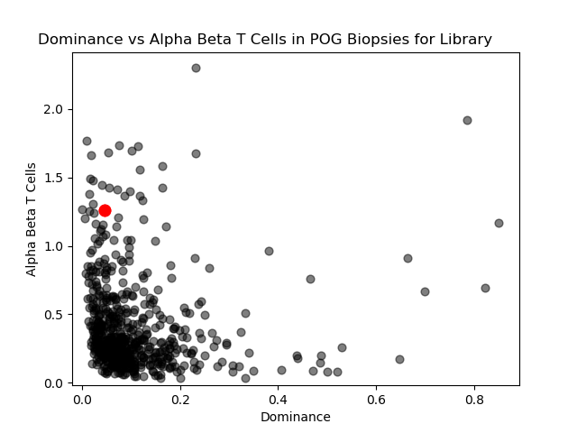
